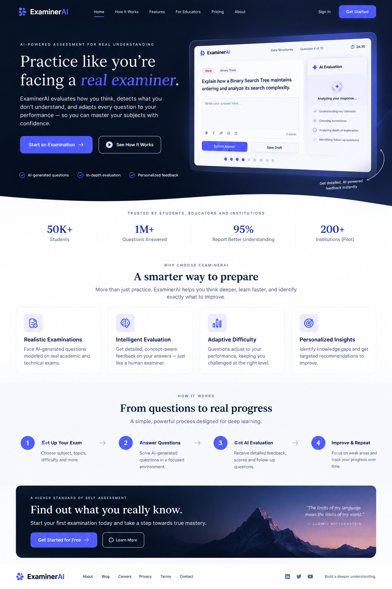
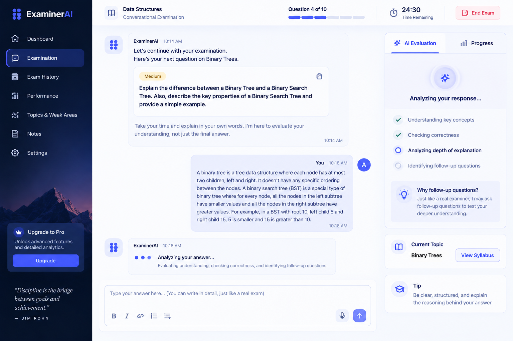
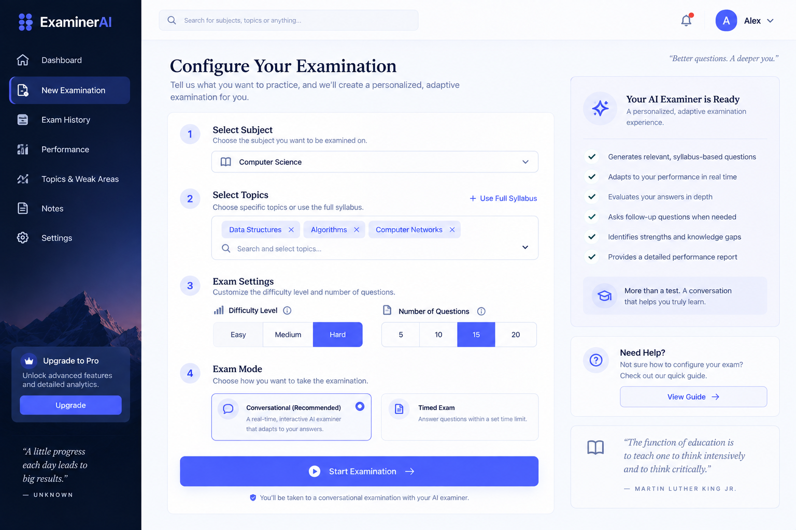
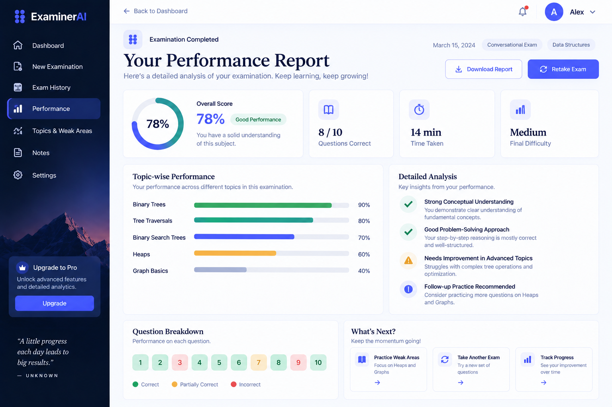
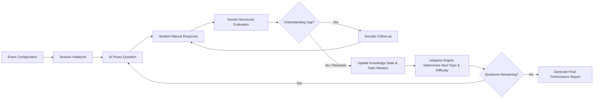

# ExaminerAI

> **An AI-powered conversational technical examination simulator for students and educators.**

ExaminerAI transforms traditional, static technical exams into dynamic, conversational oral examinations (vivas). Conducted entirely through an intelligent AI examiner, it evaluates student reasoning in real time, detects misconceptions, poses targeted Socratic follow-ups, dynamically adapts question difficulty, and generates comprehensive final performance reports.

---

## 📸 System Previews

| Homepage & Hero | AI Examiner Chat Interface |
| :---: | :---: |
|  |  |

| Exam Configuration | Final Performance Report |
| :---: | :---: |
|  |  |

---

## ⚡ Core Concepts & Examination Loop

ExaminerAI is built on the philosophy: **"I am sitting in front of an intelligent examiner."** Rather than answering a rigid list of multiple-choice questions or static forms, the student interacts in an organic, academic dialogue:



1. **Natural Dialogue & Conversational Evaluation**: The AI asks technical open-ended questions, accepts free-form answers, and rigorously evaluates conceptual depth, factual accuracy, and reasoning.
2. **Socratic Follow-Ups**: When an answer contains partial understanding, misconceptions, or ambiguity, the examiner drills down with targeted follow-up prompts before moving on.
3. **Continuous Knowledge-State Tracking**: Student proficiency across individual topics and Bloom taxonomy levels is calculated and persisted per turn.
4. **Adaptive Difficulty Engine**: Subsequent questions dynamically calibrate in difficulty (Foundational, Intermediate, Advanced) based on proven mastery.
5. **Dual RAG System**:
   - **Document RAG**: Ingests textbooks and course materials via chunked embeddings stored in Supabase `pgvector`.
   - **Web RAG**: Grounded search via Google Gemini's built-in Search Grounding tool for up-to-date and domain-specific context.
6. **Detailed Analytics & Reports**: At the conclusion of the viva, an idempotent, publication-ready performance breakdown is generated with strengths, critical gaps, and actionable recommendations.

---

## 🏗️ Repository Architecture

This repository is organized as a unified monorepo containing the frontend client, backend application, and UI/UX design assets:

```text
Exaaminer-AI/
├── exam-converse-main/          # Modern React frontend client
│   ├── src/
│   │   ├── components/ui/       # Radix UI + Tailwind design system
│   │   ├── routes/              # TanStack Router pages (Home, Exam, Report, Auth)
│   │   └── hooks/               # Custom state & interaction hooks
│   ├── package.json
│   └── vite.config.ts
│
├── examiner-ai-phase12/         # FastAPI modular monolith backend
│   ├── app/
│   │   ├── ai/                  # Gemini client, prompt engineering, structured schemas
│   │   ├── api/                 # REST endpoints (/exams, /chat/turn, /documents, etc.)
│   │   ├── db/repositories/     # Supabase persistence layer & in-memory test doubles
│   │   ├── models/              # Domain models and Enums
│   │   ├── rag/                 # Chunker, embeddings, retriever, Web RAG
│   │   └── services/            # Adaptive, evaluation, knowledge-state, report engines
│   ├── supabase/migrations/     # PostgreSQL schema definitions & pgvector extensions
│   ├── tests/                   # Complete 12-phase regression & end-to-end test suite
│   ├── requirements.txt
│   └── pyproject.toml
│
├── examinerai_design_images/    # High-fidelity visual mockups & design collage
├── .env.example                 # Unified configuration template
└── .gitignore                   # Production-grade git exclusions
```

---

## 🛠️ Technology Stack

### Backend
- **Framework**: [FastAPI](https://fastapi.tiangolo.com/) (Python 3.11+)
- **AI & LLM**: Google Gemini API (`gemini-3.8-flash` for reasoning/evaluations, `gemini-embedding-2` for 768-dim embeddings)
- **Database & Vectors**: [Supabase](https://supabase.com/) (PostgreSQL with `pgvector`)
- **Validation**: Pydantic v2
- **Testing**: Pytest with hermetic in-memory test doubles and regression gates

### Frontend
- **Framework**: [React 19](https://react.dev/) + [TypeScript](https://www.typescriptlang.org/)
- **Bundler & Tooling**: [Vite](https://vitejs.dev/) + [Bun](https://bun.sh/)
- **Routing**: [TanStack Router](https://tanstack.com/router)
- **Styling**: [Tailwind CSS v4](https://tailwindcss.com/) + custom editorial tokens (`Instrument Serif` & `Inter`)
- **Components & Icons**: [Radix UI](https://www.radix-ui.com/), [Lucide React](https://lucide.dev/), [Recharts](https://recharts.org/)

---

## 🚀 Getting Started

### 1. Prerequisites
- **Python**: `3.11` or higher
- **Node.js**: `18.x`+ or **Bun**
- **Supabase Account**: A PostgreSQL instance with `pgvector` enabled
- **Google AI Studio API Key**: For Gemini models and Google Search Grounding

### 2. Environment Setup

Copy the example environment file and populate your credentials:

```bash
cp .env.example .env
```

Ensure your `.env` contains the required keys:
```env
SUPABASE_URL=https://your-project.supabase.co
SUPABASE_SERVICE_ROLE_KEY=your-supabase-key
GEMINI_API_KEY=your-gemini-api-key
GEMINI_GENERATION_MODEL=gemini-3.8-flash
GEMINI_EMBEDDING_MODEL=gemini-embedding-2
GEMINI_EMBEDDING_DIMENSION=768
WEB_RAG_ENABLED=true
```

---

### 3. Running the Backend

Navigate to `examiner-ai-phase12` and activate a virtual environment:

```bash
cd examiner-ai-phase12
python -m venv .venv

# On Windows:
.venv\Scripts\activate
# On Linux/macOS:
source .venv/bin/activate

pip install -r requirements.txt
uvicorn app.main:app --reload --port 8000
```

The interactive OpenAPI documentation will be accessible at:
- Swagger UI: `http://localhost:8000/docs`
- ReDoc: `http://localhost:8000/redoc`

---

### 4. Running the Frontend

In a separate terminal, navigate to `exam-converse-main`:

```bash
cd exam-converse-main
npm install
npm run dev
```

The web application will launch at `http://localhost:5173`.

---

## 🧪 Testing & Verification

The backend includes a comprehensive, hermetic test suite that validates all 12 implementation phases without requiring external API network dependencies:

```bash
cd examiner-ai-phase12

# Run complete test suite
pytest -q

# Run end-to-end examination lifecycle tests
pytest -m e2e -q

# Run Python byte-compilation validation
python -m compileall app tests
```

---

## 📄 License & Attribution

Developed for **ExaminerAI**. Created and maintained by [rohitmistry2005-afk](https://github.com/rohitmistry2005-afk).
